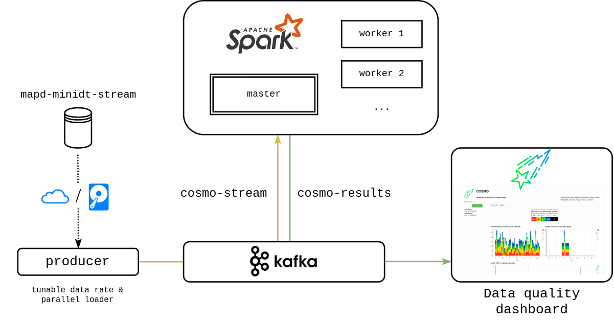
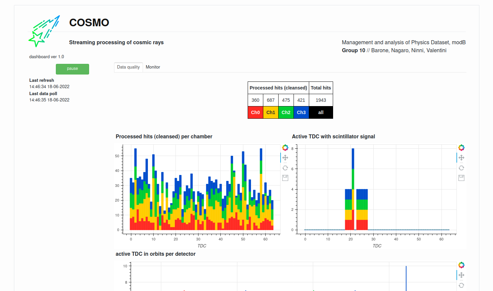

# Streaming processing of cosmic rays

<p align="center">
Management and Analysis of Physics Dataset, modB<br>
<b>Group 10</b> // Barone, Nagaro, Ninni, Valentini
</p>


This is our final project for Management and Analysis of Physics Dataset (module B). In this work, we perform **streaming processing of data collected by a particle physics detector**, publishing data quality statistics to a **dashboard for live monitoring**. The workflow is summarized in the following schema:



- **Spark**: compute the statistics about the live data
- **Kafka**: manage the data IO & deliver the statistics
- **Bokeh**: process the statistics & create a dashboard

In order to manage all the involved entities, we provide a simple **bash interface** to manage the **cluster routines**: **COSMO**.

The dataset comes from muon detectors that have been built and installed in Legnaro INFN Laboratories.

A **video demo** is available [here](https://youtu.be/V1j8BzlxaQQ), although this is NOT indicative of the final performance of our final code. Sometimes the data buffer starts before Spark and data accumulates. Eventually Spark catches up with the buffer, usually within 2 minutes. The final **dashboard** looks like this:


<br>

### COSMO

COSMO is an utility to manage the execution of remote streaming analysis. It is coded in **bash**, and it must be installed on the master node.

COSMO provides access to *functions* (which act on a single entity of our framework), as well as *routines* (which are automatized *collections of functions*). Functions are more development-oriented, for debug purpose; we suggest to use routines. The standard routines are:

| routine | action |
| :--- | :---: |
| `cosmo init` | start Spark & Kafka clusters |
| `cosmo run` | execute the streaming analysis |
| `cosmo beat` | heartbeat to the processing entities |
| `cosmo halt` | stop the streaming analysis |
| `cosmo dismiss` | stop clusters |

COSMO loads the execution parameters from a .ini **configuration file**, which must be provided inside its own directory in `./config/*`. We provide two default setups: `config/localhost` and `config/cloud`. The latter is the one we configured explicitly for Cloud Veneto. Nevertheless, even the localhost preset must be edited depending on your environment.

<br><br>

## Setup

Make sure you have installed the Python requirements (`requirements.txt`). You must have a working Spark (3.2.1) & Kafka (3.2.0) cluster.

For local execution you have to download the **dataset** from the bucket `mapd-minidt-stream`. To do this, we provide an automatic Python script in `data/local-download.py`. To make it work, you must provide the access credentials in a json file. Check out the README file inside the *data* directory for more informations.

To install Cayde, please insert the following lines in `.bashrc`:
```bash
COSMO_CONFIG_PATH='config/localhost'
cosmo() {
   `YOUR_ABSOLUTE_PATH`/cosmo.sh "$@"
}
export COSMO_CONFIG_PATH
export -f cosmo
```
replacing YOUR_ABSOLUTE_PATH with the actual absolute path of your installation. The variable COSMO_CONFIG_PATH specifies which configuration files to use.

<br>

## Execution

To start the server
```bash
cosmo init
cosmo run
```

We recommend to use a ssh tunnel forwading to reach the following interfaces:

| port  | object |
| :---: | :---   |
| 8080  | Spark master UI |
| 4040  | Application UI |
| 5006  | dashboard |
| 9002  | Kafka socket |
| 7077  | Spark master socket |

To stop the server
```bash
cosmo halt
cosmo dismiss
```

If something does not work, then debugging is needed ...

#### Cloud Veneto

Login to the *MAPD-B_Gr10-1* machine, with user *cosmo*. Then invoke `cosmo` as described above.

***

The logo of this application is provided under Flaticon License, <a href="https://www.flaticon.com/free-icons/cosmos" title="cosmos icons">Cosmos icons created by Ridho Imam Prayogi - Flaticon</a>.

***

<h5 align="center">MAPD (module B) project<br>AY 2021/2022 University of Padua</h5>

<p align="center">
  
  &emsp;
  
</p>
